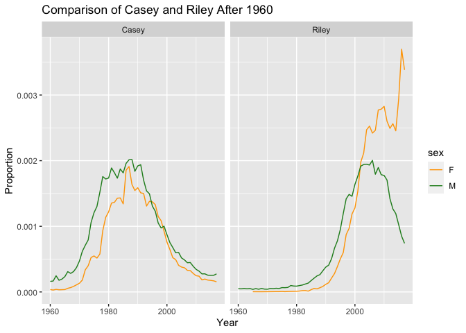

Coverpage
================

## Code:

*This code works to data wrangle the data set “babynames”. Therefore,
creating a new data set that only highlights babies named Riley or Casey
post 1960.*

``` r
babynames_riley_casey_1960_later <- babynames %>%
  filter(year >= 1960 & (name == "Riley" | name == "Casey"))
View(babynames_riley_casey_1960_later)
```

## Plot:

*This plot shows that post 1985 the baby name Riley surged, while the
baby name Casey saw an abrupt decline.*

<!-- -->

## Meme:


